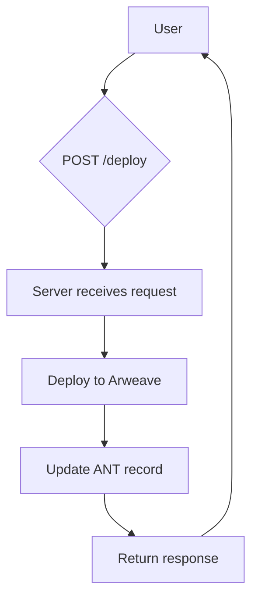

```markdown
# 🎨 aoile_backend 🚀

```ascii
  _.--""--._
 .'          `.
/   O      O   \
|    \  ^  /    |  Automating Deployments to Arweave
\   `-----'   /
 `. _______ .'
   //_____\\
  (( ____ ))
   `-----'
```

**Tagline:** Streamlining Arweave deployments with a powerful Node.js backend.


[](https://github.com/nikhilsinghrathore1/aoile_backend/blob/main/LICENSE)
[](https://nodejs.org/)
[](https://expressjs.com/)
[](https://www.arweave.org/)


---

## 🌟 Feature Highlights ✨

*   🚀 **Automated Deployments:** Effortlessly deploy your projects to Arweave.
*   🔥 **ANT Integration:** Seamlessly update ANT records for your deployments.
*   ✨ **Easy-to-use API:** Simple and intuitive RESTful API for deployment.
*   💫 **Robust Error Handling:** Comprehensive error handling for reliable deployments.
*   🎨 **Customizable Configuration:** Easily configure deployment settings.


---

## 🛠️ Tech Stack 📦

| Technology      | Version          | Badge                                      |
|-----------------|-------------------|----------------------------------------------|
| Node.js         | >=18.0.0         | [](https://nodejs.org/) |
| Express.js      | ^5.1.0           | [](https://expressjs.com/) |
| Arweave SDK     | ^1.15.0          | [](https://www.arweave.org/) |
| @ar.io/sdk     | ^3.13.0          | [](https://github.com/ArweaveTeam/@ar.io/sdk) |
| @ardrive/turbo-sdk | ^1.8.0 | [](https://github.com/ArDrive/turbo-sdk) |
| Axios           | ^1.9.0           | [](https://axios-http.com/) |
| Other Dependencies | See `package.json` | [](https://www.npmjs.com/) |


---

## 🚀 Quick Start ⚡

1.  **Clone the repository:**

    ```bash
    git clone https://github.com/nikhilsinghrathore1/aoile_backend.git
    ```

2.  **Install dependencies:**

    ```bash
    cd aoile_backend
    npm install
    ```

3.  **Start the server:**

    ```bash
    npm start
    ```

---

## 📖 Detailed Usage 📚

This application provides a `/deploy` endpoint that accepts a POST request with the following body:

```json
{
  "html": "<html>...</html>",
  "undername": "@your-undername" 
}
```

Here's a curl example:

```bash
curl -X POST -H "Content-Type: application/json" -d '{"html": "<html><h1>Hello!</h1></html>", "undername": "@nikhil"}' http://localhost:3000/deploy
```


The response will include the transaction ID, Arweave URL, and ARNS URL.

> **Important:** Ensure you have a `config.json` file in the root directory with the correct ANT process ID, ARNS name, and wallet path.  See the Configuration section below for details.


---

## 🏗️ Project Structure 📁

```
aoile_backend/
├── app/             // Contains application logic
│   ├── server.js    // Main server file
│   └── deploysdk.js // Deployment logic
├── deploy/          // Directory for deployment files (created dynamically)
│   └── index.html  // Example deployment file
├── config.json      // Configuration file
└── package.json     // Project metadata and dependencies
```

---

## 🎯 API Documentation 📊

| Endpoint    | Method | Description                                      | Request Body                               | Response Body                                   |
|-------------|--------|--------------------------------------------------|-------------------------------------------|-------------------------------------------------|
| `/deploy`   | POST    | Deploys HTML content to Arweave and updates ANT | `{ "html": "<html>...</html>", "undername": "your-undername" }` | `{ "success": true/false, "txId": "...", "arweaveUrl": "...", "arnsUrl": "..." }` |


---

## 🔧 Configuration Options ⚙️

| Option        | Description                                                              | Type    | Default     |
|----------------|--------------------------------------------------------------------------|---------|--------------|
| `antProcess`  | Your ANT process ID.                                                    | String  | Required    |
| `arnsName`    | Your ARNS name.                                                           | String  | Required    |
| `walletPath`  | Path to your Arweave wallet JSON file.                                  | String  | Required    |


---

## 📸 Screenshots/Demo 📱

**(Add screenshots here.  Use markdown image syntax: ``)**

---

## 🤝 Contributing Guidelines 🛠️

1.  Fork the repository.
2.  Create a new branch (`git checkout -b feature/your-feature`).
3.  Make your changes and commit them (`git commit -m "Add your feature"`).
4.  Push the branch to your forked repository (`git push origin feature/your-feature`).
5.  Create a pull request.


---

## 📜 License and Acknowledgments 🌟

This project is licensed under the [AGPL-3.0-only](https://github.com/nikhilsinghrathore1/aoile_backend/blob/main/LICENSE) license.  Thanks to the Arweave team for their amazing work!


---

## 👥 Contributors 💻

**(Add contributor avatars and links here)**


---

## 📞 Support and Contact 🌐

[](https://twitter.com/intent/tweet?text=Check%20out%20this%20awesome%20project%3A%20https%3A%2F%2Fgithub.com%2Fnikhilsinghrathore1%2Faoile_backend)

<details><summary><b>FAQ</b></summary>
  <p><b>Q: What is the size limit for deployments?</b></p>
  <p>A: Currently, the free tier of the Turbo SDK limits deployments to 100KB.  Larger deployments may require a paid plan.</p>
  <p><b>Q: How do I update my ANT record?</b></p>
  <p>A: Ensure that your `config.json` contains the correct values for `antProcess`, `arnsName`, and `walletPath`. The server automatically updates the ANT record after a successful deployment.</p>
</details>


